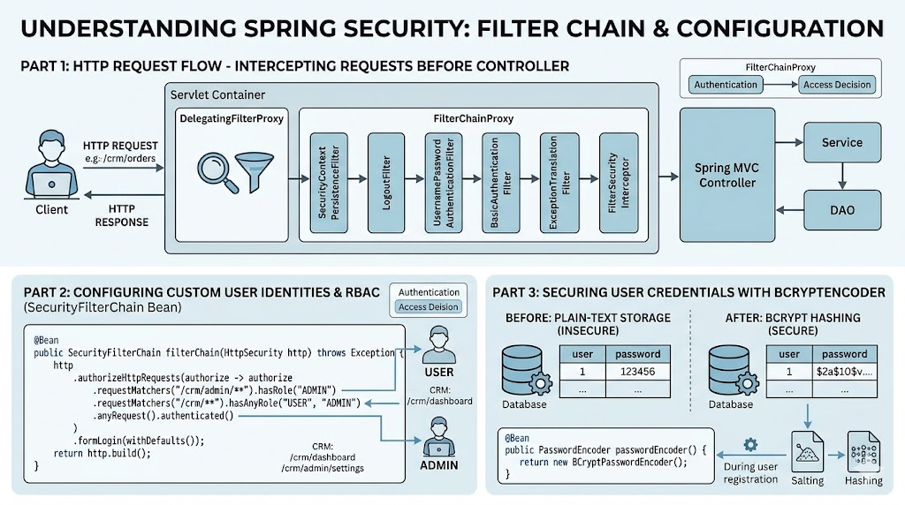

# [4.1] Spring Security Fundamentals & Securing Simple-CRM

## Lesson Overview

## Dependencies

- [Self Studies](./studies.md) / [Lesson](./lesson.md) / [Assignment](./assignment.md)

## Lesson Objectives

By the end of this lesson, students will be able to:

* **Illustrate** the flow of an HTTP request through the Spring Security Filter Chain to explain how requests are intercepted before reaching a Controller
* **Configure** custom user identities and Role-Based Access Control (RBAC) using a `SecurityFilterChain` bean to protect specific CRM endpoints
* **Implement** a `BCryptPasswordEncoder` to secure user credentials, moving from plain-text storage to industry-standard hashing

## Lesson Plan

| Duration | What | How or Why |
|---|---|---|
| 10 min | Warm-up | Recap Spring Boot REST concepts and the `simple-crm` project structure — students are securing the same project today |
| 15 min | Part 1: Why Security Matters | Real-world context — what happens when APIs are left unsecured; introduce Authentication vs Authorization with the office building analogy |
| 25 min | Part 1: Security Filter Chain | Explain the checkpoint model; walk through how a request flows from browser → filter chain → controller; introduce `401` vs `403` |
| 15 min | Part 2: Add Security Starter + Observe Default Behavior | Code-along — add dependency, restart app, observe the auto-generated login page and console UUID password |
| 10 min | Part 2: Configure Static Credentials in application.properties | Code-along — set `spring.security.user.name` and `password`; test with Postman Basic Auth |
| 15 min | Part 3: BCrypt Password Encoding | Explain why plain-text passwords are dangerous; introduce hashing as a one-way process; explain why BCrypt is the industry standard |
| 30 min | Part 3: SecurityConfig — FilterChain + UserDetailsService | Code-along — create `config` package and `SecurityConfig.java`; define `PasswordEncoder`, `SecurityFilterChain`, and `UserDetailsService` beans; explain each section |
| 20 min | Part 4: Activity — Secure CRM Endpoints + Postman Testing | Students update `SecurityConfig` to add DELETE restriction; test with `sales_rep` (403) and `manager` (200) credentials |
| 10 min | Wrap-up | Recap AuthN vs AuthZ, filter chain, BCrypt, RBAC; preview next lesson |
| **150 min** | **Total** | |